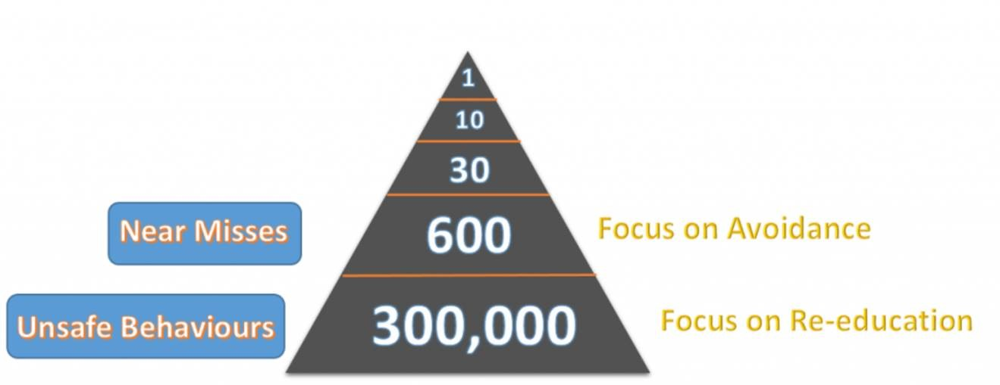

# Safety: Start at the  Bottom and Stay There!
by Evan Trevathan

## Goal
Predict likelihood of the next safety incident being a recordable incident using "Heinrich's Accident Pyramid" theory.


## Data
1. The dataset considered was the SafetyApp data:
   - Excluded all records that were soft deleted.
   - Pulled data on 4/18/2018
   - 10,698 rows
   - 88 original features
   - Utilized 13 features from original dataset plus 1 feature from Asset table.
   - Created/Altered 4 features
   - All data manipulation performed in SQL
* Could utilize the SafetyPlus data if necessary:
   - Would need to map to selected feature set.
   - 28,506 rows
   - 562 original features

## Approach
Implement [Multinomial Time Series Regression](https://www.hlp.rochester.edu/resources/WOMM/BarrFrank.pdf) to model the likelihood the next data entry point is a recordable incident. We will classify the data as either recordable or non-recordable and utilize the ratios from Heinrich's Accident Pyramid theory applied to BP Lower 48 Safety entries.

## Project Progression
1. Feature selection and creation done.
1. Dataset loaded into Pandas.
1. Research has begun on algorithm details.

<!-- #### Model Pipeline Code
    ```
    TBD    
    ``` -->
